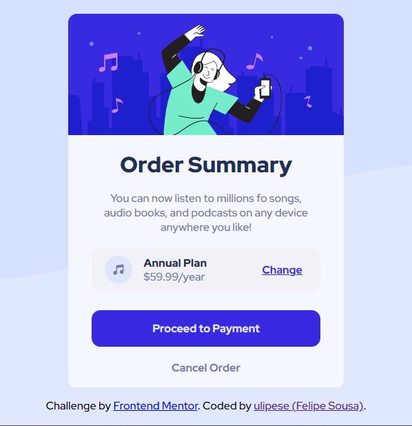

## Table of contents

- [Overview](#overview)
  - [The challenge](#the-challenge)
  - [Screenshot](#screenshot)
- [My process](#my-process)
  - [Built with](#built-with)
  - [What I learned](#what-i-learned)
  - [Useful resources](#useful-resources)
- [Author](#author)

## Overview

### The challenge

  -Create the site as close as possible  
  -Use Sass to learn more

### Screenshot

### Demo
<iframe src="https://ulipese.github.io/order-summary-project/" height="200" width="300" title="Order Summary Demo">

</iframe>

## My process

1. I saw the layout (see the directory 'design')
2. I did the HTML with BEM architecture
3. I did the style with Sass, a bit of Grid and Flexbox

### Built with

- Semantic HTML5 markup
- BEM architecture
- Flexbox
- CSS Grid
- [Sass](https://sass-lang.com/) - Sass for styles

### What I learned

I learn to use the basic of Grid and Sass.

### Useful resources

- [Grid](https://developer.mozilla.org/pt-BR/docs/Web/CSS/grid) - This helped me as a guide.
- [Sass](https://www.w3schools.com/sass/) - This helped me to learn Sass.

## Author

- Website - [Felipe Sousa](https://www.github/.com/ulipese)
- Frontend Mentor - [@ulipese](https://www.frontendmentor.io/profile/ulipese)
- Twitter - [@ulipese](https://www.twitter.com/ulipese)
